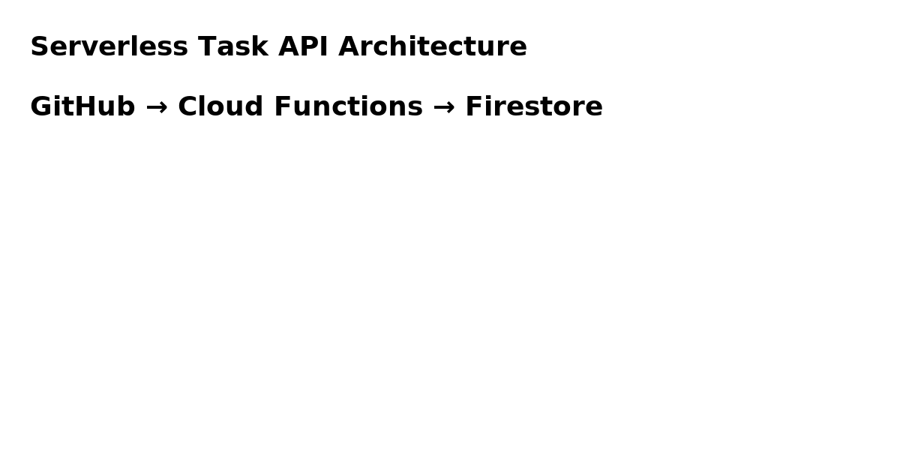

# Serverless Task Management API (GCP)

## 📌 Overview
A serverless REST API built with **Python (Flask)**, deployed on **Google Cloud Functions**, and backed by **Firestore** for storage.

## 🚀 Features
- Create, Read, Update, Delete (CRUD) tasks
- Serverless deployment (no VM management)
- Secure with API keys / IAM
- Scales automatically

## 🛠 Tech Stack
- **Python 3**
- **Google Cloud Functions**
- **Firestore**
- **Flask**

## 📂 Architecture


## ⚙️ Setup & Deployment

1. **Enable APIs**
```bash
gcloud services enable cloudfunctions.googleapis.com firestore.googleapis.com
```

2. **Set Firestore to Native Mode**
- Go to GCP Console → Firestore → Create Database → Native Mode.

3. **Deploy Cloud Function**
```bash
gcloud functions deploy tasks_api \
  --runtime python310 \
  --trigger-http \
  --allow-unauthenticated
```

4. **Test API**
```bash
curl -X POST "YOUR_FUNCTION_URL" \
  -H "Content-Type: application/json" \
  -d '{"title": "First Task"}'
```

5. **List Tasks**
```bash
curl -X GET "YOUR_FUNCTION_URL"
```

## 📸 Screenshots
(Add screenshots of deployment, API responses, and Firestore data here)

## 📜 License
MIT License
